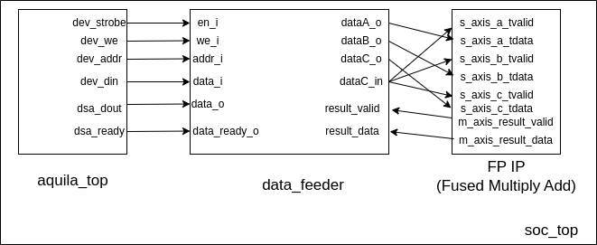

# Handwriting Recognition using Domain-Specific Accelerator

## Project Overview
This project focuses on implementing a domain-specific accelerator (DSA) to optimize the inner product of  a digit handwriting recognition system using a Multi-Layer Perceptron (MLP). Based on `aquila`, a RISC-V 5 pipelined stage core implemented by Embedded Intelligence System Lab (EISL). The aim is to accelerate the inner product calculations that are integral to the evaluation phase of MLP-based digit recognition. 

## Features
- **MMIO-based interaction**: Utilizes memory-mapped input/output (MMIO) for device communication.
- **Floating Point IP**: Add fused multiply-add IP in Vivado using non-blocking techniques to enhance performance during inner product calculations.
- **MLP Optimization**: Focuses on optimizing the evaluation phase of the MLP, particularly the inner product computations crucial for digit recognition.

## Implementation Details
- **Software**: Modifies the C code to directly assign inner product calculations for MLP layers to MMIO-mapped addresses, avoiding costly function calls like `__mulsf` and `__addsf`.
- **Hardware**: Implements a data feeder within the `soc_top.v` module that interacts with a floating-point IP to accelerate inner product operations in the MLP.
- **Non-Blocking Design**: Utilizes a non-blocking mechanism for data processing in MLP evaluations, improving efficiency by reducing stall cycles.

## block diagram

## Performance
- Profiling shows significant performance improvements in the MLP's inner product evaluation phase due to the optimized accelerator design.
- The overhead associated with data input and output is fixed and unaffected by latency due to the consistent number of computations in the MLP.

## Results
This design demonstrates substantial speedup in MLP evaluation, particularly in accelerating inner product calculations critical for digit handwriting recognition.

## Future Work
Further improvements could focus on extending the MLP model to handle more complex datasets or investigating more advanced acceleration techniques for deeper networks.

