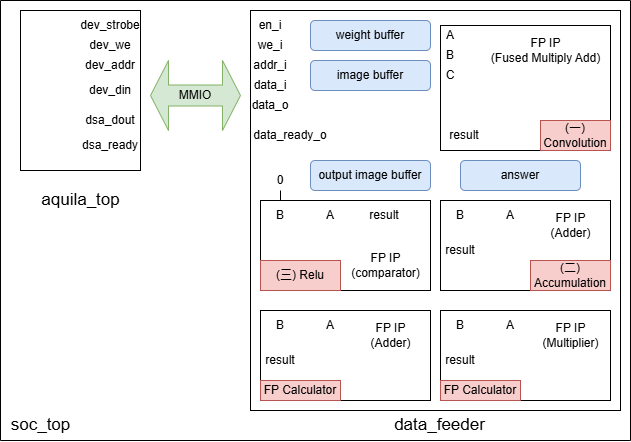

# **Handwriting Recognition using CNN (Domain-Specific Accelerator)**  

## **Project Overview**  
This project focuses on implementing a **Domain-Specific Accelerator (DSA)** to accelerate the inner product operations in a **Convolutional Neural Network (CNN)** for handwriting recognition. The design is based on **`aquila`** — a RISC-V 5-stage pipelined core developed by the **Embedded Intelligence System Lab (EISL)**. The primary focus is on optimizing the **convolutional layer** and **fully connected layer** Floating Point  computations (mainly focus on convolution) to improve CNN performance.  

## **Current Performance**  
   - Execution time reduced: **21502 ms → 807 ms** (26.64speedup) 
---

## **System Architecture**  
  
  
---

## **Current Progress**

1. **MMIO-based Communication**  
   - Uses **Memory-Mapped I/O (MMIO)** for communication between the CPU and the accelerator, enabling efficient hardware-software co-design.  

2. **Floating-Point IP Acceleration**  
   - Integrated three floating-point IP core in **Vivado**, utilizing a non-blocking approach to accelerate inner product calculations, floating point multiplication, addition , compare (for relu), and reduce bottlenecks.  

3. **CNN Optimization**  
   - **Convolutional Layer Optimization**: Put the whole calculation in `convolutional_layer_forward_propagation` in `convolutional_layer.h` file, including the whole convolution calculation and relu, and simplify the code in this layer.
   - **Fully Connected Layer Optimization**: Enhanced the efficiency of inner product computations in the **fully_connected_layer**.  
   - **Average Pooling Layer Optimization**: Improved the speed of inner product calculations and addition.  

4. **Heap Management in TCM**  
   - Stored the **weight arrays** and **previous layer's feature maps** in **TCM (Tightly Coupled Memory)** using a dynamically managed **TCM heap**. Custom **tcm_malloc** and **tcm_free** functions were implemented, alongside linker script modifications to ensure seamless allocation without conflicting with boot code. This optimization effectively reduces cache latency and improves memory access efficiency.  

---

## **Recent Work**  

1. **Pooling Layer Circuit Design**  
   - Pooling layer is the current bottlenect (75%).
---
